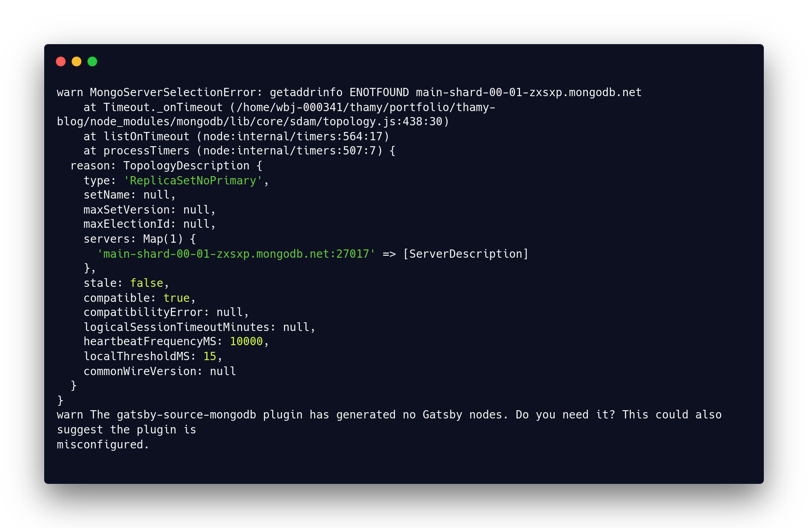
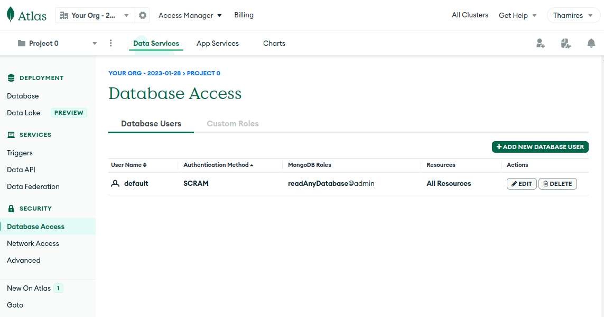
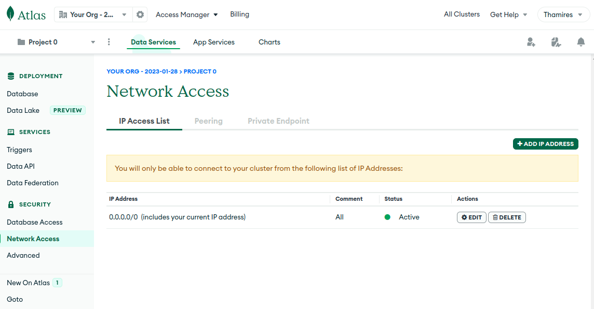
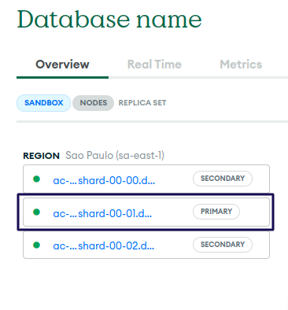

import PreCode from '../../src/components/Paragraphs/PreCode'
import TheSpanInYellow from '../../src/components/Paragraphs/TheSpanInYellow.js'

If you were excited to add you MongoDB databases in gatsby projects and was following this [Build a Modern Blog with Gatsby and MongoDB](https://www.mongodb.com/developer/languages/javascript/gatsby-modern-blog/#connecting-mongodb-and-gatsbyjs) tutorial you maybe got and error (like I did).

The error shows up when you run `gatsby develop`, after seting up the `gatsby-config.js`, in the `source and transform node` the log stops for an moment and there is:



The error says: `warn MongoServerSelectionError: getaddrinfo ENOTFOUND main-shard-00-01-zxsxp.mongodb.net` and on the bottom of the log error there is and Gatsby message: `warn The gatsby-source-mongodb plugin has generated no Gatsby nodes. Do you need it? This could also suggest the plugin is misconfigured.` Leaving aside the mockery: "Do you need it?" - yes gatsby I need it, he tells us that *MAYBE* there is a misconfiguration going on.

After some digging I manage to work around this issue. For that I had to look into the MongoDB Atlas admin and change some things. First I needed to add access to an default user, under the **Security** tab in **Database Access**:



Second I add an new global network access with the IP address of `0.0.0.0/0`. 



After that I tried to add the IP address to the `gataby-config.js` to the `server{ adress: <IP> }` but I was also greeted with the same error. 

But I notice the address provided by the author of the post had an pattern `<server-region>-shard-00-01-<something-obscure>.mongodb.net`. With that in mind I made my way through the admin page and find something similar to that.

Under **Deployment** tab in **Database** you have a special tab called **Overview** that shows the *regions*:



So I thought *"Maybe I can use this in the server address"*. And so I did. Changed to the primary one, added the authentication user and password that I created and **It worked!!** 🎉

My final `gatsby-config.js` file it's like below, you can now change with your MongoDB configurations and hopefully it will work too!

<PreCode>
```js

plugins: [
    {
        resolve: 'gatsby-source-mongodb',
        options: {
            dbName: 'portfolio',
            collection: 'latin_phrases',
            server: {
                address: 'ac-u2aonht-shard-00-01.dqustge.mongodb.net',
                port: 27017
            },
            auth: {
                user: 'default',
                password: 'LPO1HvEWC9WW0uQZ'
            },
            extraParams: {
                ssl: true,
                authSource: 'admin',
                retryWrites: true
            }
        }
    }
]

```
</PreCode>
